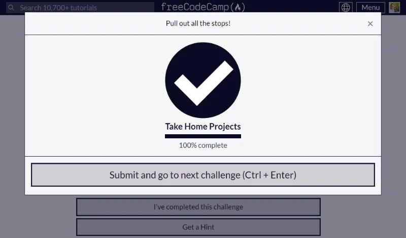
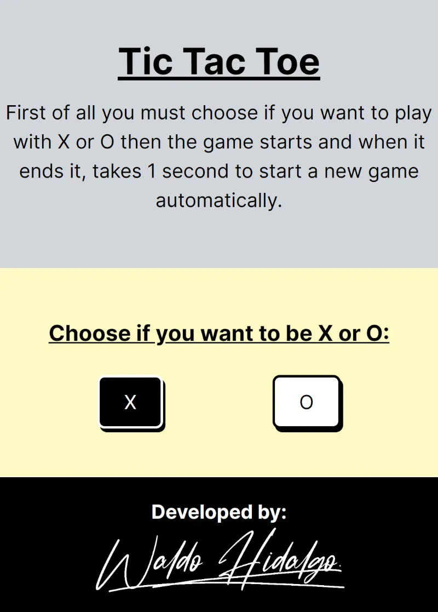
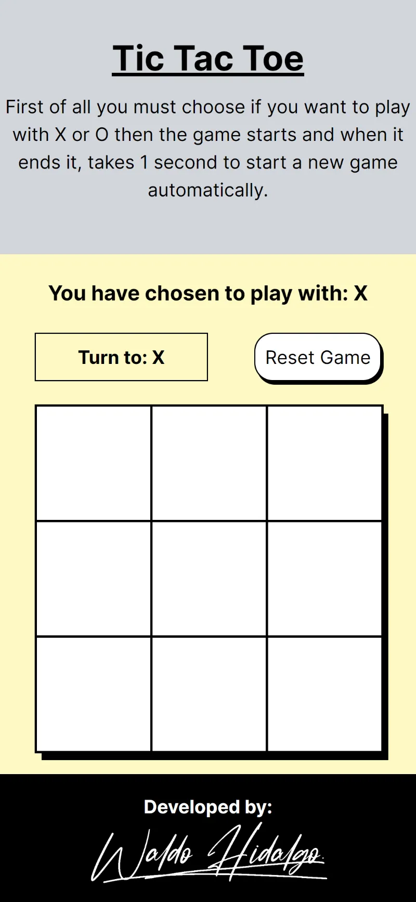
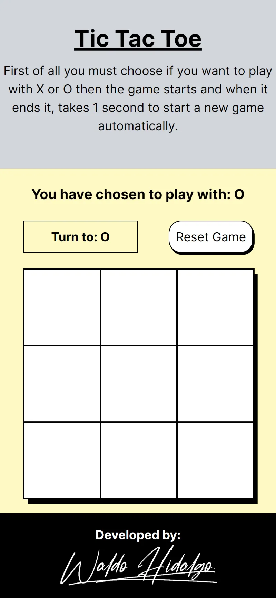
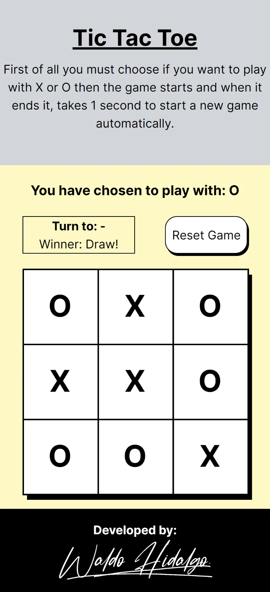
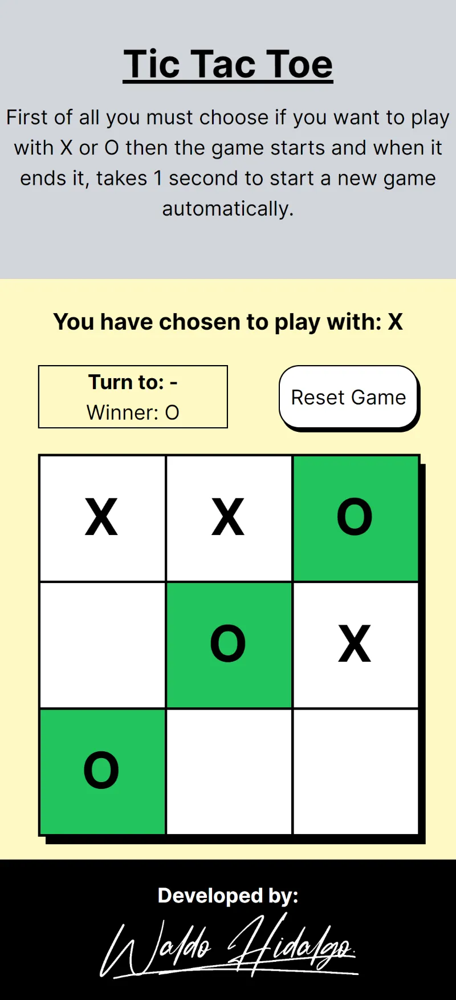
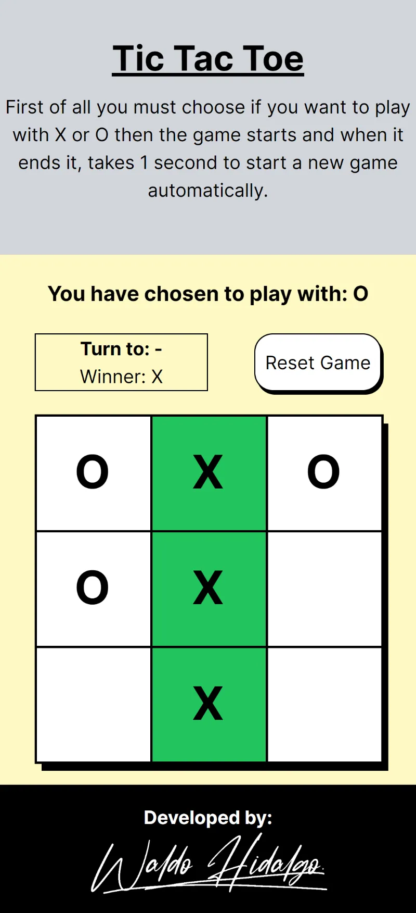

# Build a Tic Tac Toe Game

Repositorio del challenge [Build a Tic Tac Toe Game](https://www.freecodecamp.org/learn/coding-interview-prep/take-home-projects/build-a-tic-tac-toe-game) el cual es requisito obligatorio para obtener la **Legacy Front End Certification** de freecodecamp.

El proyecto implementa un algoritmo **Minimax** para averiguar la mejor posición de jugada para el computador. Destaco la siguiente [fuente](https://www.freecodecamp.org/news/how-to-make-your-tic-tac-toe-game-unbeatable-by-using-the-minimax-algorithm-9d690bad4b37/) en la cual se explica el algoritmo. La jugada del computador es realizada cada 500 milisegundos y cuando el juego ha finalizado se resetea al estado inicial transcurridos 1000 milisegundos.

## Tabla de Contenidos

- [Build a Tic Tac Toe Game](#build-a-tic-tac-toe-game)
  - [Tabla de Contenidos](#tabla-de-contenidos)
  - [Proyecto Aprobado](#proyecto-aprobado)
  - [Screenshots](#screenshots)
    - [1-UI inicial](#1-ui-inicial)
    - [2-Selector de X para jugar](#2-selector-de-x-para-jugar)
    - [3-Selector de O para jugar](#3-selector-de-o-para-jugar)
    - [4-Draw](#4-draw)
    - [5-Winner O](#5-winner-o)
    - [6-Winner X](#6-winner-x)

## Proyecto Aprobado

## Screenshots

### 1-UI inicial

### 2-Selector de X para jugar

### 3-Selector de O para jugar

### 4-Draw

### 5-Winner O

### 6-Winner X

