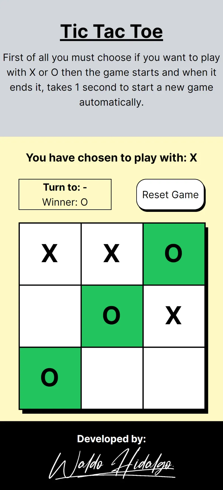

# Build a Tic Tac Toe Game

Repositorio del challenge [Build a Tic Tac Toe Game](https://www.freecodecamp.org/learn/coding-interview-prep/take-home-projects/build-a-tic-tac-toe-game) el cual es requisito obligatorio para obtener la **Legacy Front End Certification** de freecodecamp.

El proyecto implementa un algoritmo **Minimax** para averiguar la mejor posición de jugada para el computador. Destaco la siguiente [fuente](https://www.freecodecamp.org/news/how-to-make-your-tic-tac-toe-game-unbeatable-by-using-the-minimax-algorithm-9d690bad4b37/) en la cual se explica el algoritmo.

## Tabla de Contenidos

## Proyecto Aprobado

## Screenshots

### 1-UI inicial

### 2-Selector de X para jugar

### 3-Selector de O para jugar

### 4-Draw

### 5-Winner

